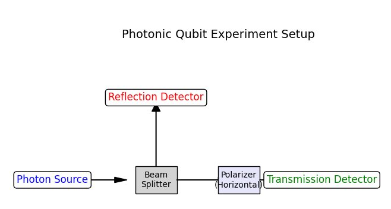

# psikit

**psikit** is a lightweight, beginner-friendly quantum computing framework designed for simulating quantum optics experiments—especially those involving photonic qubits. The library provides an intuitive interface for representing quantum states, applying quantum gates (such as beam splitters), and simulating projective measurements with state collapse. It is ideal for educational purposes and rapid prototyping of quantum experiments.

## Features

- **Quantum State Representation**: Represent quantum states as vectors.
- **Quantum Gates**: Define and apply quantum gates (e.g., beam splitter operations).
- **Measurement Simulation**: Perform projective measurements that simulate state collapse.
- **Modular Design**: Easily extendable framework to incorporate additional quantum operations and experiments.

## Example: Photonic Qubit Experiment

In the included example, a photonic qubit is prepared in a known state (e.g., |0⟩), passed through a beam splitter (which creates a superposition of two paths: "Transmission" and "Reflection"), and then measured. The framework simulates the collapse of the photon's state onto one of these paths based on the calculated probabilities.

```py
from psikit.experiments import simulate_photonic_qubit_experiment, plot_experiment_diagram

simulate_photonic_qubit_experiment()
plot_experiment_diagram()
```


## Installation

Clone the repository and install the required dependency (NumPy):

```bash
git clone https://github.com/agomlabs/psikit.git
cd psikit
python setup.py
```

## Roadmap  
We have a long-term vision for psikit. Here’s what we plan to achieve in upcoming releases:  
- [ ] Extend support for multi-qubit simulations  
- [ ] Improve visualization for quantum states and transformations  
- [ ] Implement more quantum gates beyond beam splitters and polarizers  
- [ ] Support integration with real quantum hardware  
- [ ] Develop a plugin system for community-contributed modules  

## Citation
If you use psikit in your research or publications, please consider citing our library using the following reference:
```bibtex
@misc{psikit2025,
  title = {{psikit}: A Lightweight Quantum Computing Framework},
  author = {{AgomLabs}},
  year = {2025},
  note = {Available at \url{https://github.com/agomlabs/psikit}},
}
```
Feel free to modify the citation format according to your requirements.

## Contributing
Contributions are welcome! Please fork the repository and submit pull requests with your improvements.

## About Us
**AgomLabs** is an open-source organization dedicated to developing cutting-edge, free, and open-source technologies for people and developers. At AgomLabs, our mission is to build scalable and cost-effective solutions that empower the community and drive technological innovation. We also develop specialized technologies for large businesses.  
For more information, please visit our website: [labs.agom.ir](https://labs.agom.ir).
